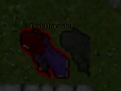
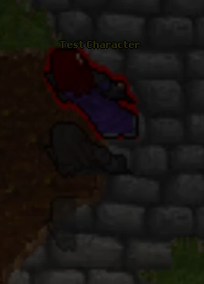

# Q6 - Nickolas Cerrone

<h3>Video Demo (couldn't get this one to embed natively for some reason)</h3>

<a href="https://github.com/ncerroneumich/tavernlight-games-trial/blob/main/Q6/media/Question6_Nickolas_Cerrone.mp4">Github Link Here</a> <br/>
<a href="https://www.youtube.com/embed/GqpazUWW-fc?si=r_1vUXHVnag04nfy">Youtube Link Here for Easy Viewing</a>

<h3>Overview</h3>

This question was definitely the most challenging! It required many hours of scouring forum posts, investigating shaders, and browsing the source code for OTClient. On the server side I was able to create a spell makes the player dash forward, stopping when blocked by obstacles. On the cleint side I was able to listen for this spell's casting and then trigger a custom draw function for the player during the dash. This custom draw function was largely adapting other code from the client, but still required a lot of thought to get correct. 


I was have included the OTClient and spell files here. A walkthrough of the whole process can be found below.

<h3>Walkthrough</h3>

We'll begin by going through the server side code, which is a pretty basic spell. It took a few attempts at messing with different server side functions, but eventually I landed on this implementation of the spell.

<h4>Server Side Code</h4>

```Lua
local dash_interval = 100  -- Interval between each dash in milliseconds
local full_distance = 4    -- Full distance to dash initially
local slow_distance = 1    -- Slow distance to dash twice after the initial dash

-- Function to calculate the new position based on direction and distance
function calculateNewPosition(position, direction, distance)
    local newPosition = Position(position)  -- Create a copy to avoid unwanted modification

    if direction == 0 then
        newPosition.y = newPosition.y - distance
    elseif direction == 1 then
        newPosition.x = newPosition.x + distance
    elseif direction == 2 then
        newPosition.y = newPosition.y + distance
    elseif direction == 3 then
        newPosition.x = newPosition.x - distance
    end

    return newPosition
end

function performDash(creatureId, distance)
    local creature = Creature(creatureId)
    if creature == nil then
        return
    end

    local direction = creature:getDirection()
    local originalPosition = creature:getPosition()

    local intermediatePosition = nil
    local lastWalkablePosition = nil  -- To keep track of the last walkable position

    -- Check each intermediate tile for walkability
    for i = 1, distance do
        intermediatePosition = calculateNewPosition(originalPosition, direction, i)
        local intermediateTile = Tile(intermediatePosition)
        if intermediateTile:isWalkable() then
            lastWalkablePosition = Position(intermediatePosition)  -- Update last walkable position
        else
            break  -- Exit the loop if a non-walkable tile is found
        end
    end

    -- Teleport to the last walkable position if any intermediate positions were walkable
    if lastWalkablePosition ~= nil then
        creature:teleportTo(lastWalkablePosition)
    end
end

-- Function to handle the casting of the dash spell
function onCastSpell(creature, variant)
    print("dash spell cast!")

    local creatureId = creature:getId()

    -- Start dash routine
    performDash(creatureId, full_distance)
    addEvent(performDash, dash_interval, creatureId, slow_distance)
    addEvent(performDash, 2 * dash_interval, creatureId, slow_distance)

    return true
end


```

<h4>Client Code</h4>

Here we have the basic client module code that checks if a dash spell was cast. It isn't a perfect solution as it won't end the dashing condition if the player's dash spell ends early, but this was the solution I was able to come to in the allotted time.

```Lua
local DASH_TEXT = "dash"             -- Text command to trigger the dash
local DASH_LENGTH_MS = 300           -- Duration of the dash in milliseconds

local dash_event = nil               -- Variable to hold the scheduled dash event

-- Function to initialize the script and connect the onTalk event
function init()
    connect(g_game, {
        onTalk = onTalk
    })
end

-- Function to terminate the script and disconnect the onTalk event
function terminate()
    disconnect(g_game, {
        onTalk = onTalk
    })
end

-- Function to handle the onTalk event
function onTalk(name, level, mode, text, channelId, pos)
    print("onTalk: " .. text)
    if text == DASH_TEXT then
        local player = g_game.getLocalPlayer()
        if player ~= nil then
            player:setDashing(true) -- Set the player's dashing state to true
            dash_event = scheduleEvent(stopDash, DASH_LENGTH_MS)  -- Schedule the stopDash function to run DASH_LENGTH_MS
        end
    end
end

-- Function to stop the dash
function stopDash()
    local player = g_game.getLocalPlayer()
    if player ~= nil then
        print("in stopDash()")
        player:setDashing(false)         -- Set the player's dashing state to false
        removeEvent(dash_event)          -- Remove the scheduled dash event
        dash_event = nil                 -- Reset the dash_event variable
    end
end

```

Next we'll go through the OTClient code that actually renders the dashing player. Our goal is to give our player and outline and display some after image effects behind them. We achieve the outline effect with a shader based off of Mehah's solid outline shader which can be found [here](https://github.com/mehah/otclient/blob/main/modules/game_shaders/shaders/fragment/outline.frag).

```glsl
// The texture we are outlining
uniform sampler2D u_Tex0;
// The current texture coordinate
varying mediump vec2 v_TexCoord;
// The distance away from v_TexCoord that we sample to check for border pixels
const float offset = 0.001;

void main()
{
    // Get the color at the current texture coord
    vec4 col = texture2D(u_Tex0, v_TexCoord);

    // Sample all adjacent pixels to check for border
    float a = texture2D(u_Tex0, vec2(v_TexCoord.x + offset, v_TexCoord.y)).a +
                         texture2D(u_Tex0, vec2(v_TexCoord.x, v_TexCoord.y - offset)).a +
                         texture2D(u_Tex0, vec2(v_TexCoord.x - offset, v_TexCoord.y)).a +
                         texture2D(u_Tex0, vec2(v_TexCoord.x, v_TexCoord.y + offset)).a;

    // If this pixel is transparent and our neightbors aren't, we are a border pixel
    if (a > 0 && col.a < 1.0) {
        gl_FragColor = vec4(1.0, 0.0, 0.0, 1.0);
    } 
    // Else, don't modify the output
    else {
        gl_FragColor = col;
    }
}
```

I decided to create a new draw function that toggles when the player is dashing. It required minor modifications to a few other lines of code, but this is the main code that renders the outline and after image effect. The after image effect is achieved by adding additional draw calls staggered behind the player with a reduction in opacity on each render.

```C++
/*
Special drawing call for when the player is dashing. Basically stripped out as much as possible from the drawOutfit function and added code to render the dash shaders. Order of rendering isn't too important here due to the spacing of the after images.
*/
void Creature::drawDashing(const Point& dest, float scaleFactor, bool animate, LightView* lightView) {
    // Get the type of this thing for later reference
    auto datType = rawGetThingType();

	// Get a modifiable copy of the destination
    Point outfitDest = dest;

    // xPattern is the creature direction
    int xPattern = m_direction;
    int zPattern = 0;
    int yPattern = 0;
    int animationPhase = 0;

    // Setup our outline shader
    PainterShaderProgramPtr shader = PainterShaderProgramPtr(new PainterShaderProgram);
    shader->addShaderFromSourceCode(Shader::Vertex, glslMainWithTexCoordsVertexShader + glslPositionOnlyVertexShader);
    shader->addShaderFromSourceCode(Shader::Fragment, glslOutlineFragmentShader);
    shader->link();
    g_painter->setShaderProgram(shader);

    // Draw the original creature uncolored
    datType->draw(outfitDest, scaleFactor, 0, xPattern, yPattern, zPattern, 0, nullptr);

    // Reset the shader program after the first draw call
    shader->release();
    g_painter->resetShaderProgram();

    // Color the outfit of the creature
	colorOutfit(outfitDest, scaleFactor, animate, lightView, xPattern);

    // Offset constant for after images
    const int offsetStep = 25;

    // Define the after image offsets based on direction
    Point afterImageOffsets[3];
    for (int i = 0; i < 3; ++i) {
        if (m_direction == Otc::North) {
            afterImageOffsets[i] = Point(0, (i + 1) * offsetStep);
        }
        else if (m_direction == Otc::South) {
            afterImageOffsets[i] = Point(0, -(i + 1) * offsetStep);
        }
        else if (m_direction == Otc::East) {
            afterImageOffsets[i] = Point(-(i + 1) * offsetStep, 0);
        }
        else if (m_direction == Otc::West) {
            afterImageOffsets[i] = Point((i + 1) * offsetStep, 0);
        }
    }

    // After image variables
    float afterImageOpacity = 0.8f;
    float afterImageOpacityDecay = 0.2f;
	Color afterImageColor(0.3, 0.3, 0.3, 1.0f);

    // Draw the after images
    for (const auto& offset : afterImageOffsets) {
        // Reduce the opacity for the after image
        datType->setOpacity(afterImageOpacity);

        // Darken the color for the after image
		g_painter->setColor(afterImageColor);

		// Draw the after image with custom draw function
        datType->drawOffset(outfitDest, offset, scaleFactor, 0, xPattern, yPattern, zPattern, 0, nullptr);

		// Reduce the opacity for the next after image
        afterImageOpacity -= afterImageOpacityDecay;
    }

	// Reset the opacity for the creature
	datType->setOpacity(1.0f);
}
```

I'll also go over the other small modifications I made. Here is a fucntion that paints the color on the player's outfit. I decided to not apply this to the after images for stylistic purposes.

```C++
void Creature::colorOutfit(const Point& dest, float scaleFactor, bool animate, LightView* lightView, int xPattern) {
    // Multiply effectively paints the colors over a white outfit
    Painter::CompositionMode oldMode = g_painter->getCompositionMode();
    g_painter->setCompositionMode(Painter::CompositionMode_Multiply);

    auto datType = rawGetThingType();

    // Paint head
    g_painter->setColor(m_outfit.getHeadColor());
    datType->draw(dest, scaleFactor, SpriteMaskYellow, xPattern, 0, 0, 0, lightView);

    // Paint body
    g_painter->setColor(m_outfit.getBodyColor());
    datType->draw(dest, scaleFactor, SpriteMaskRed, xPattern, 0, 0, 0, lightView);

    // Paint legs
    g_painter->setColor(m_outfit.getLegsColor());
    datType->draw(dest, scaleFactor, SpriteMaskGreen, xPattern, 0, 0, 0, lightView);

    // Paint feet
    g_painter->setColor(m_outfit.getFeetColor());
    datType->draw(dest, scaleFactor, SpriteMaskBlue, xPattern, 0, 0, 0, lightView);

    // Reset g_painter
    g_painter->setCompositionMode(oldMode);
    g_painter->resetColor();
}
```

Finally, I'll also go over the after image offset. I created a custom draw function for the ```ThingType``` class that takes in an offset and also allows for modification of the g_painter color (normally it resets the color to white by default).

```C++
void ThingType::drawOffset(const Point& dest, const Point& offset, float scaleFactor, int layer, int xPattern, int yPattern, int zPattern, int animationPhase, LightView* lightView)
{
    // Default draw code above...

    // Updated the screenRect calculation to include the offset
    Point finalDest = dest + offset;
    Rect screenRect(finalDest + (textureOffset - m_displacement - (m_size.toPoint() - Point(1, 1)) * 32) * scaleFactor, textureRect.size() * scaleFactor);

	// Don't set the color to white automatically, let the caller handle the color
    const Color& color = g_painter->getColor();
    g_painter->setColor(Color(color.rF(), color.gF(), color.bF(), m_opacity));

    // Default draw code below...
}
```

All other code should be the same in the client. I was pretty proud with this implementation as I initially thought it would require a lot of modification.

<h4>Considerations and Post-Mortem</h4>

It would be easy to just show how good my solution is, but I thought I'd also adress the issues that this solution has. As addressed above, the dash effect will not end when the player collides with a non-walkable object. I believe there are ways to get around this with my solution, but I unfortunately did not have time to add them in.

The biggest issue has to do with rendering. When dashing in certain directions, my code will render with textures cut off.

Here is the artifact when dashing left.



And here it is when dashing up.



 I wrestled with the source code a lot before I gave up on this, as it was simply taking up too much time. If I had a better understanding of the texture processing pipeline in OTClient, I believe this would be an easy fix.

The hardest part of these questions were at the beginning when I had little to no knowledge of what I was doing, but after getting the layout of the client codebase, it started to get pretty enoyable. Exploring this codebase reminded me of my own game engine code. Having that experience really helped me here. It gave me the understanding I needed to tackle this problem and without that project I don't think I would've been able to complete this question.

 
